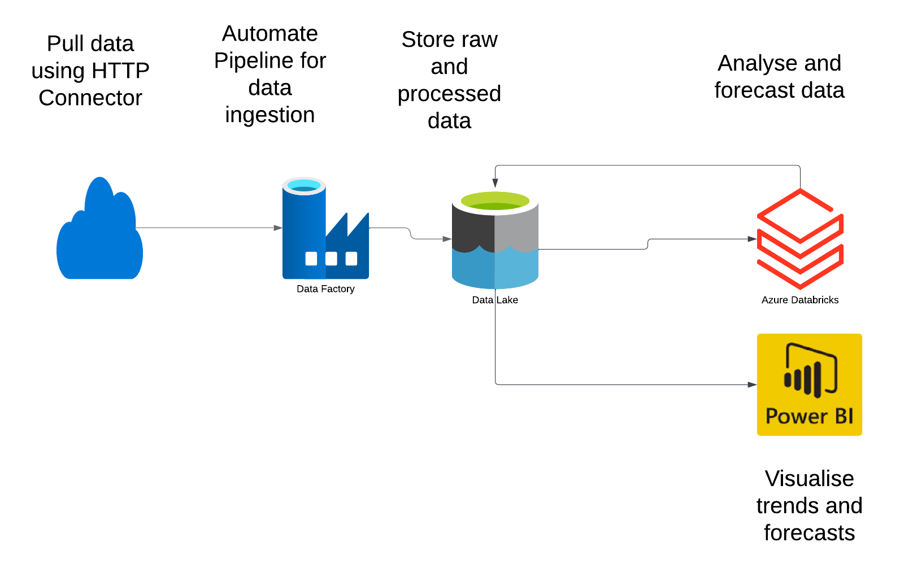
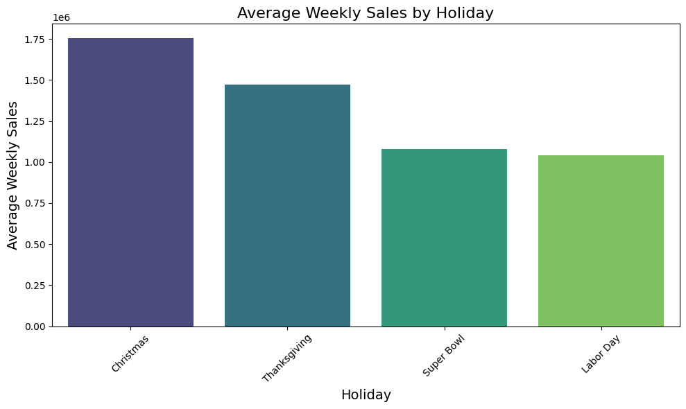
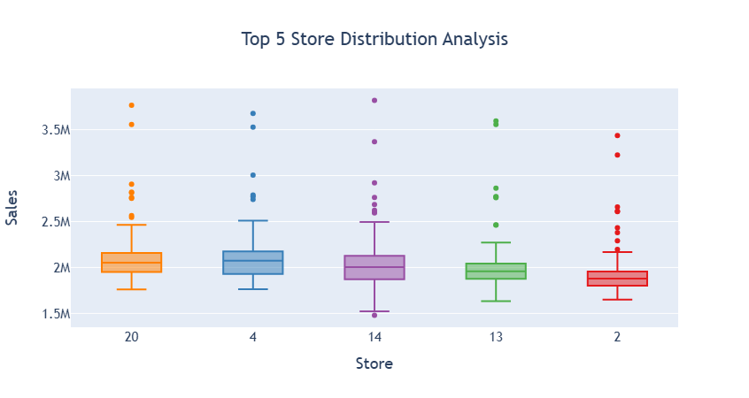
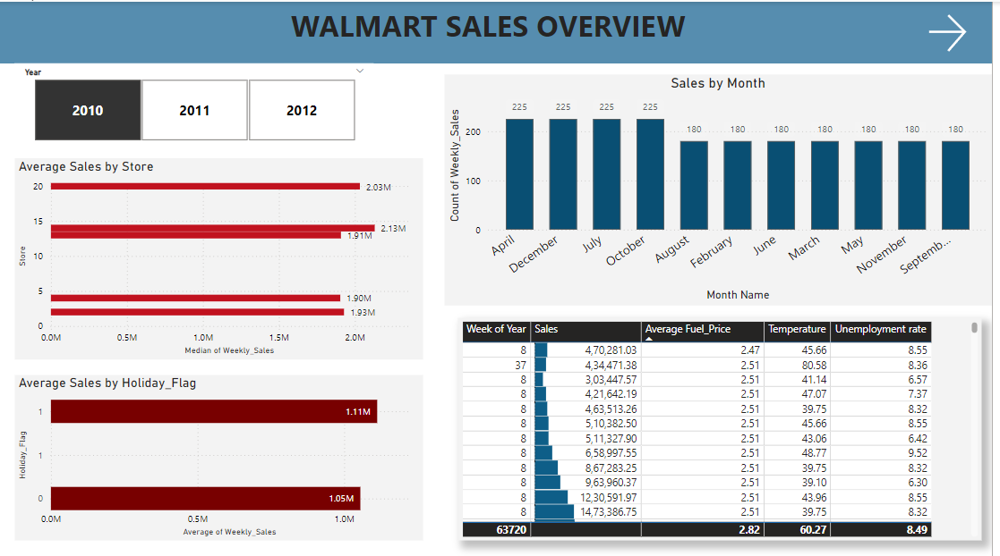
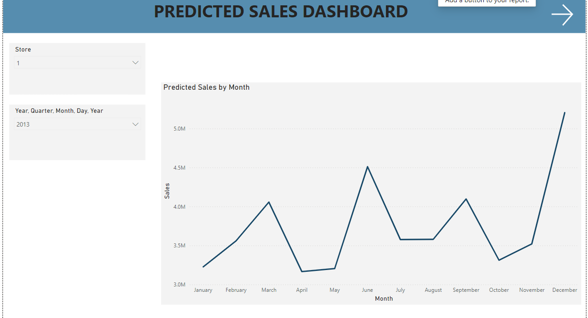

# Azure End-to-End Walmart Sales Forecasting Project
This project focuses on analyzing Walmart's sales data using Azure services to uncover insights into seasonal trends, store performance, and the impact of external factors like holidays, fuel prices, and unemployment rates. By leveraging Azure Data Factory, Azure Data Lake, Azure Databricks, and Power BI, the project supports data-driven decision-making for optimizing sales strategies.

## **Overview**

This project demonstrates an end-to-end data analytics solution using Azure services to process and analyze Walmart sales data. Through a series of automated pipelines and tools, I designed a seamless workflow to ingest, transform, analyze, and visualize data to extract meaningful insights for business decision-making.

## **Project Architecture**

        +-----------+                  +-----------+                +---------------+
        |           |                  |           |                |               |
        | HTTP Data |    +--------->   |  Azure    |    +---------> | Azure         |
        | Ingestion |                  | Data Lake |                | Databricks    |
        | (API)     |                  | Storage   |                | (Data         |
        |           |                  |           |                | Analysis & forecasting model)|
        +-----------+                  +-----------+                +---------------+
                                                                           |
                                                                           |
                                    +-----------------+                    |
                                    |                 |                    |
                                    | Data Lake       | <-----------------+
                                    |                 |
                                    | Storage         |
                                    +-----------------+
                                            |
                                            v
                                    
                                            |
                                            v
                                    +-----------------+
                                    | Power BI        |
                                    | Visualization   |
                                    +-----------------+

### **Tools and Technologies Used**
**Azure Services:**
- **Azure Data Lake**: For scalable storage of raw and processed data
- **Azure Databricks**: For data analysis and forecasting.
- **Azure Data Factory**: For orchestrating data pipelines.

**Programming and Tools:**
- **Python**(libraries used- Pandas, Numpy, Matplotlib, seaborn): Used in Databricks notebooks (PySpark).
- **Power BI Desktop**: For visualization and insights.

  
## **Project Setup and Workflow**
1. **Data Ingestion:** Raw data is ingested into Azure Data Lake Storage via HTTP API.
2. **Data Transformation and Analysis:** Exploratory Data Analysis.
3. **Forcasting Model:** Generated Time series Forecasting Model( Prophet)
4. **Visualization:** Insights are visualized in Power BI.
   

## 1.Data Ingestion
The data is ingested from an HTTP endpoint to Azure Data Lake using Azure Data Factory.

**Data Source**
The dataset used in this project is a Walmart sales data originally downloaded from Kaggle. 
For this project:
The dataset was uploaded to a GitHub repository to simulate an HTTP endpoint.
The data was accessed via the Azure Data Factory HTTP connector and ingested into Azure Data Lake for storage and further processing.
**Dataset link**
- Kaggle Dataset: [Kaggle](https://www.kaggle.com/datasets/asahu40/walmart-data-analysis-and-forcasting)
- GitHub Repository: [Github](https://github.com/Sivapriyajl/datasetsupload)

**Data Ingestion Pipeline**
**Source**: GitHub repository (HTTP connector in Azure Data Factory).
**Sink**: Azure Data Lake (Raw data folder).
**Pipeline Configuration**: The HTTP connector was configured to fetch the data in real-time. Data Factory pipelines automated the ingestion process and ensured data availability for downstream processes.

**Steps:**

1. Create a Linked Service To Http Connector
2. Create a Source Data Set
3. Create a Linked Service To Azure Data Lake storage (GEN2)
4. Create a Sink Data set
5. Create a Pipeline for data ingestion
- Execute Copy activity when the file becomes available
6. Create a trigger 

![Ingestion Pipeline][def]

[def]: Azure_screenshots/Screenshot_1.png

## 2.Data Transformation and Analysis
After ingesting the data into Azure Data Lake, the next step is accessing the data in Databricks for further processing.

**Steps to Mount Azure Data Lake to Databricks:**
- App Registration in Azure AD:

Registered an application in Azure Active Directory to enable secure access to the Azure Data Lake Storage.
- Assigning Role Permissions:

Assigned the Storage Blob Data Contributor role to the registered application for the Data Lake Storage account to ensure appropriate access permissions.
- Generating Authentication Credentials:

Generated the client ID, client secret, and tenant ID for the registered application to be used in Databricks.
- Mounting the Data Lake to Databricks:

Utilized the Databricks dbutils.fs.mount() function to mount the Azure Data Lake Storage.

**EDA**
Performed Exploratory Data Analysis in Azure Databricks to analyze sales patterns, seasonality, and trends.

From the bar chart, it is clear that weekly sales peak during the Christmas holidays, averaging approximately 1.75 million. Among the four holiday weeks, Labor Day records the lowest weekly sales.

Store number 20, 4 and 14 has the highest number of sales. This could be dependened on temperature, geographical location,unemployment etc.

.png)

This scatter plot visualizes the relationship between temperature and weekly sales, with the holiday weeks highlighted using a color gradient (Holiday_Flag). The data shows that weekly sales are concentrated across varying temperature ranges, with no strong linear correlation between the two variables. However, holiday weeks (indicated in yellow) show scattered spikes in sales, suggesting that holidays significantly influence weekly sales, independent of temperature variations

## 3.Forecasting Model
Built a time-series forecasting model using Python libraries. Generated a forecast for the next two years at a weekly frequency to help businesses make data-driven decisions for inventory planning and resource allocation..

 
 

 **Observed Data (Black Dots):** Represents the actual sales over time. Clear seasonal spikes are seen, especially around specific weeks.
 **Forecasted Line (Blue Line):** Represents the predicted sales trends. Shows a smoother decline compared to observed data, indicating the model’s ability to generalize trends.
 Wider intervals after 2013 suggest higher uncertainty due to the lack of data for that period. The forecast predicts a gradual decline in sales over time from 2013, with notable seasonal spikes during holidays. 

### Limitations
- Accuracy of the forecast cannot be tested as future actual sales data is unavailable.
- The model assumes that the relationships between external factors and sales remain consistent.

### Future Work
- Improve the model by incorporating additional regressors like advertising spend and competitor pricing.
- Validate the model through backtesting or cross-validation using historical data.

**Model Execution Pipeline**
- **Purpose:** Automate the execution of the Databricks notebook for forecasting weekly sales.
- **Cluster Type:** Job Cluster in Databricks
- **Output Storage:** The forecated sales data for the next years was saved back to Azure Data Lake.

**Steps:**
1. Create a Linked Service To Databricks
2.  Create a forecating model execution Pipeline
- Execute Databricks Notebook 
3. Run a manual trigger
4.  Create a parent pipeline
- Execute Pipeline Activities: Used to link and execute the two individual pipelines.
5. Create Storage Event trigger

## 4.Visualization

**PowerBI Dashboard**
- Create a connection from Azure Datalake to Powerbi and load the data
- Load both historical and forecasted data into Power BI for insights.
- Analyse sales trends on months and in each stores
- Analyse the effect of other factors on weekly sales
- Visualise the predicted sales

## Conclusions and Recommendation

Purpose of the project was to build a seamless working pipeline and to forecast the weekly sales of watlmart with the available historical data. it also aims to understand whether sales are relatively higher during holidays like Christmas and Thanksgiving than normal days so that stores can work on creating promotional offers that
increase sales and generate higher revenue. By exploratory data analysis , the performance of stores and how temperature and holidays affect sales trend is also analysed. 
**Limitations**
One of the limitation was the historical sales data available was only between 2010 and 2012.Because of this limited past history data, models cannot be
trained as efficiently to give accurate results and predictions. It is tough to predict how the consumer buying behavior changes over the years.

**Recommendation**
- Introduce targeted promotions and discounts during non-holiday periods to maintain sales momentum.
- Invest in online sales platforms, including a user-friendly mobile app and website, and improve delivery logistics to cater to changing customer behavior.
- Expand promotions and discounts during key shopping seasons (e.g., Thanksgiving, Christmas).
- Introduce loyalty programs or special offers to retain customers during off-peak periods.
- Focus on affordability during economic challenges.

## Challenges faced during Project

- The dataset did not have Kaggle API support, which prevented direct access using an HTTP connector as planned.
  Resolution: The dataset was downloaded manually, uploaded to GitHub, and accessed via its API to simulate the HTTP data ingestion process in the pipeline.
- Using the pay-as-you-go pricing model for Azure Databricks significantly increased costs during data processing and model development stages.
  Resolution: To mitigate costs, tasks were optimized by reducing cluster uptime.
- The Prophet library, essential for time-series forecasting, is not natively compatible with PySpark, limiting the ability to fully utilize PySpark’s distributed computing power.
  Resolution: Pandas, NumPy, Matplotlib, and Seaborn were used for forecasting and visualization.
- Running job clusters to execute the forecasting model in Azure Databricks caused a significant increase in costs during pipeline execution.
  Resolution: Efforts were made to reduce cluster runtime.
- Identifying the causes behind the projected decline in sales required an in-depth correlation analysis with external factors such as fuel prices and unemployment rates.
  Resolution:Analysis in PowerBI and provide actionable recommendations.
- The cost of using Azure services increased significantly during exploratory data analysis and model building stages, limiting the ability to conduct further evaluation and accuracy testing.
  Resolution: Efforts were made to optimize resource usage, but some advanced evaluations had to be scaled down or postponed.
- After completing the project and uploading data to Power BI, Azure services were deleted to manage costs. However, this caused issues with data transformation and visualization when additional modifications were needed.
  Resolution: Preemptive steps were taken to finalize visualizations before service deletion, but further updates or iterations were not possible without reconfiguring the pipeline.

[def2]: Azure_screenshots/Blank%20diagram.png
