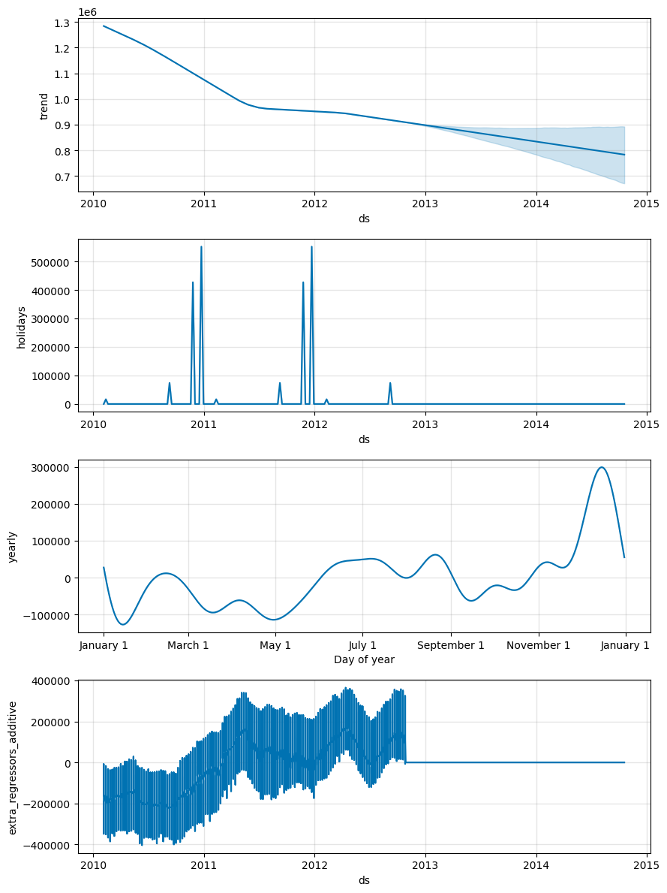
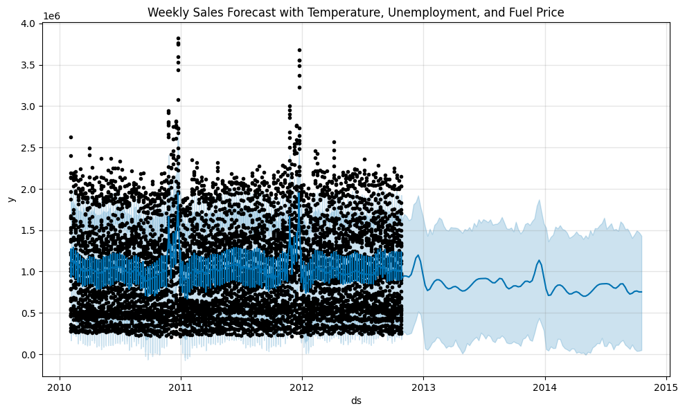
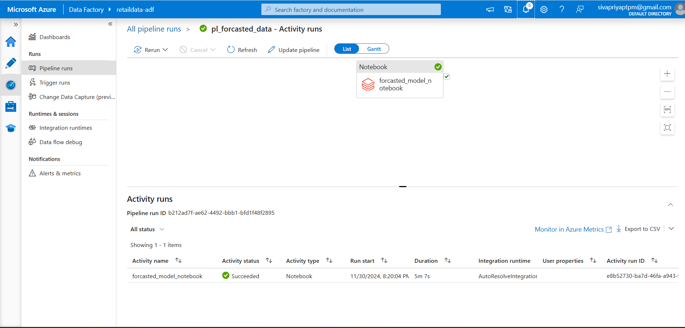
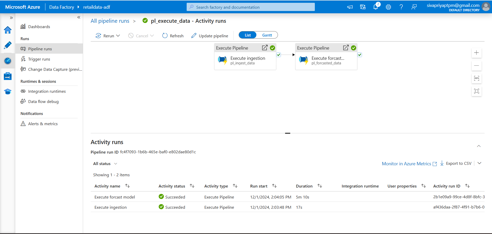

# Azure End-to-End Walmart Sales Forecasting Project
An ETL pipeline project using Azure Data Factory, Azure SQL, and Power BI for data ingestion, transformation, analysis, and visualization.

## **Overview**

This project demonstrates an end-to-end data analytics solution using Azure services to process and analyze Walmart sales data. Through a series of automated pipelines and tools, I designed a seamless workflow to ingest, transform, analyze, and visualize data to extract meaningful insights for business decision-making.

## **Project Architecture**

        +-----------+                  +-----------+                +---------------+
        |           |                  |           |                |               |
        | HTTP Data |    +--------->   |  Azure    |    +---------> | Azure         |
        | Ingestion |                  | Data Lake |                | Databricks    |
        | (API)     |                  | Storage   |                | (Data         |
        |           |                  |           |                | Transformation)|
        +-----------+                  +-----------+                +---------------+
                                                                           |
                                                                           |
                                    +-----------------+                    |
                                    |                 |                    |
                                    | Data Lake       | <-----------------+
                                    | Processed Data  |
                                    | Storage         |
                                    +-----------------+
                                            |
                                            v
                                    +-----------------+
                                    | Azure Synapse   |
                                    | Analytics (SQL) |
                                    | Data Analysis   |
                                    +-----------------+
                                            |
                                            v
                                    +-----------------+
                                    | Power BI        |
                                    | Visualization   |
                                    +-----------------+

### **Tools and Technologies Used**
**Azure Services:**
- **Azure Data Lake**: For scalable storage of raw and processed data
- **Azure Databricks**: For data transformation.
- **Azure Data Factory**: For orchestrating data pipelines.

**Programming and Tools:**
- **Python**: Used in Databricks notebooks for data transformation (PySpark).
- **Power BI Desktop**: For visualization and insights.

  
## **Project Setup and Workflow**
1. **Data Ingestion:** Raw data is ingested into Azure Data Lake Storage via HTTP API.
2. **Data Transformation and Analysis:** Data is processed in Azure Databricks and saved back to Data Lake.
3. **Forcasting Model:** 
4. **Visualization:** Insights are visualized in Power BI.
   

### 1.Data Ingestion
The data is ingested from an HTTP endpoint to Azure Data Lake using Azure Data Factory.

**Data Source**
The dataset used in this project is a online retail dataset originally downloaded from Kaggle. 
For this project:
The dataset was uploaded to a GitHub repository to simulate an HTTP endpoint.
The data was accessed via the Azure Data Factory HTTP connector and ingested into Azure Data Lake for storage and further processing.
**Dataset link**
- Kaggle Dataset: [Kaggle](https://www.kaggle.com/datasets/asahu40/walmart-data-analysis-and-forcasting)
- GitHub Repository: [Github](https://github.com/Sivapriyajl/datasetsupload)

**Data Ingestion Pipeline**
**Source**: GitHub repository (HTTP connector in Azure Data Factory).
**Sink**: Azure Data Lake (Raw data folder).
**Pipeline Configuration**: The HTTP connector was configured to fetch the data in real-time. Data Factory pipelines automated the ingestion process and ensured data availability for downstream processes.

**Steps:**

1. Create a Linked Service To Http Connector
2. Create a Source Data Set
3. Create a Linked Service To Azure Data Lake storage (GEN2)
4. Create a Sink Data set
5. Create a Pipeline for data ingestion
- Execute Copy activity when the file becomes available
6. Create a trigger 

![Ingestion Pipeline][def]

[def]: Azure_screenshots/Screenshot_1.png

### 2.Data Transformation and Analysis
After ingesting the data into Azure Data Lake, the next step is accessing the data in Databricks for further processing.

**Steps to Mount Azure Data Lake to Databricks:**
- App Registration in Azure AD:

Registered an application in Azure Active Directory to enable secure access to the Azure Data Lake Storage.
- Assigning Role Permissions:

Assigned the Storage Blob Data Contributor role to the registered application for the Data Lake Storage account to ensure appropriate access permissions.
- Generating Authentication Credentials:

Generated the client ID, client secret, and tenant ID for the registered application to be used in Databricks.
- Mounting the Data Lake to Databricks:

Utilized the Databricks dbutils.fs.mount() function to mount the Azure Data Lake Storage.

**EDA**
Performed Exploratory Data Analysis in Azure Databricks to analyze sales patterns, seasonality, and trends.

From the bar chart, it is clear that weekly sales peak during the Christmas holidays, averaging approximately 1.75 million. Among the four holiday weeks, Labor Day records the lowest weekly sales.

![Store Distribution Analysis][def3]

[def3]: Azure_screenshots/newplot.png
Store number 20, 4 and 14 has the highest number of sales. This could be dependened on temperature, geographical location,unemployment etc.

![Temperature vs Weekly Sales][def2]

This scatter plot visualizes the relationship between temperature and weekly sales, with the holiday weeks highlighted using a color gradient (Holiday_Flag). The data shows that weekly sales are concentrated across varying temperature ranges, with no strong linear correlation between the two variables. However, holiday weeks (indicated in yellow) show scattered spikes in sales, suggesting that holidays significantly influence weekly sales, independent of temperature variations
[def2]: Azure_screenshots/newplot(1).png

### 3.Forecasting Model
Built a time-series forecasting model using Python libraries. Generated a forecast for the next two years at a weekly frequency to help businesses make data-driven decisions for inventory planning and resource allocation..

 
 

 **Observed Data (Black Dots):** Represents the actual sales over time. Clear seasonal spikes are seen, especially around specific weeks.
 **Forecasted Line (Blue Line):** Represents the predicted sales trends. Shows a smoother decline compared to observed data, indicating the model’s ability to generalize trends.
 Wider intervals after 2013 suggest higher uncertainty due to the lack of data for that period. The forecast predicts a gradual decline in sales over time from 2013, with notable seasonal spikes during holidays. 

### Limitations
- Accuracy of the forecast cannot be tested as future actual sales data is unavailable.
- The model assumes that the relationships between external factors and sales remain consistent.

### Future Work
- Improve the model by incorporating additional regressors like advertising spend and competitor pricing.
- Validate the model through backtesting or cross-validation using historical data.

**Model Execution Pipeline**
**Purpose:** Automate the execution of the Databricks notebook for forecasting weekly sales.
**Cluster Type:** Job Cluster in Databricks
**Output Storage:** The forecated sales data for the next years was saved back to Azure Data Lake.

**Steps:**
1. Create a Linked Service To Databricks
2.  Create a forecating model execution Pipeline
- Execute Databricks Notebook 
3. Run a manual trigger
4.  Create a parent pipeline
- Execute Pipeline Activities: Used to link and execute the two individual pipelines.

### 4.Visualization

**PowerBI Dashboard**
- Imported both historical and forecasted data into Power BI for insights.
