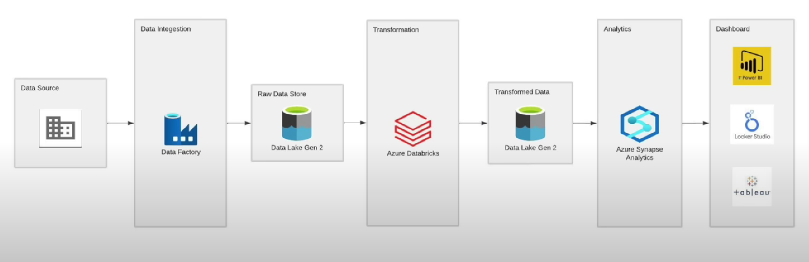

# Data-Analytics-ETL-Pipeline-with-Azure-ADF-and-Power-BI
An ETL pipeline project using Azure Data Factory, Azure SQL, and Power BI for data ingestion, transformation, analysis, and visualization.

## **Overview**

This project demonstrates an end-to-end data analytics solution using Azure services to process and analyze retail data. Through a series of automated pipelines and tools, I designed a seamless workflow to ingest, transform, analyze, and visualize data to extract meaningful insights for business decision-making.

## **Project Architecture**

        +-----------+                  +-----------+                +---------------+
        |           |                  |           |                |               |
        | HTTP Data |    +--------->   |  Azure    |    +---------> | Azure         |
        | Ingestion |                  | Data Lake |                | Databricks    |
        | (API)     |                  | Storage   |                | (Data         |
        |           |                  |           |                | Transformation)|
        +-----------+                  +-----------+                +---------------+
                                                                           |
                                                                           |
                                    +-----------------+                    |
                                    |                 |                    |
                                    | Data Lake       | <-----------------+
                                    | Processed Data  |
                                    | Storage         |
                                    +-----------------+
                                            |
                                            v
                                    +-----------------+
                                    | Azure Synapse   |
                                    | Analytics (SQL) |
                                    | Data Analysis   |
                                    +-----------------+
                                            |
                                            v
                                    +-----------------+
                                    | Power BI        |
                                    | Visualization   |
                                    +-----------------+

### **Tools and Technologies Used**
- Azure Data Lake: For scalable storage of raw and processed data
- Azure Databricks: For data transformation.
- Azure Synapse Analytics (Serverless SQL): For SQL-based data analysis.
- Azure Data Factory: For orchestrating data pipelines.
- Power BI: For visualization and insights.
  
### **Project Setup and Workflow**
1. **Data Ingestion:** Raw data is ingested into Azure Data Lake Storage via HTTP API.
2. **Data Transformation:** Data is processed in Azure Databricks and saved back to Data Lake.
3. **Data Analysis:** Processed data is analyzed using serverless SQL in Azure Synapse Analytics.
4. **Visualization:** Insights are visualized in Power BI.
   

